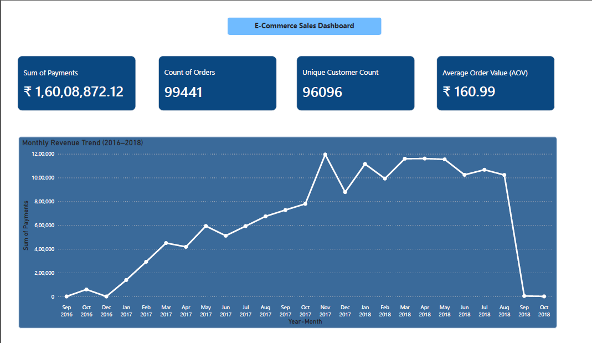
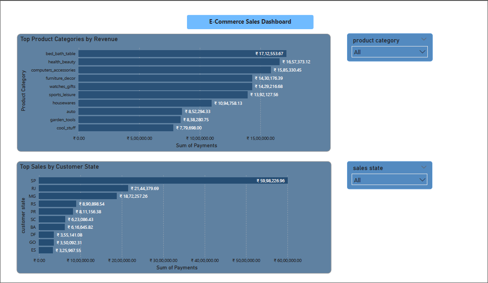
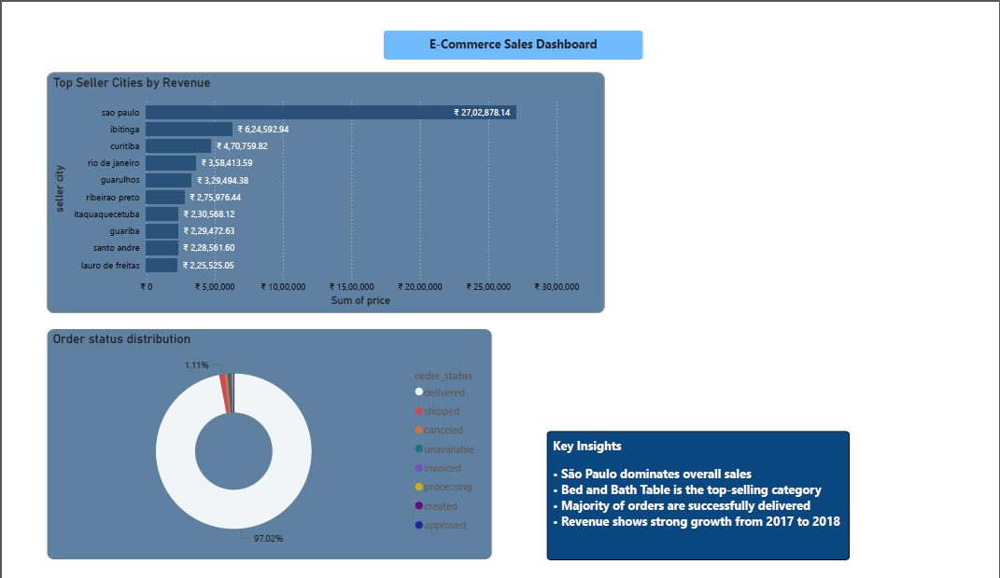

# E-Commerce Analytics Dashboard using Python, SQL & Power BI

## Project Overview

This project analyzes Brazilian e-commerce sales data and builds an interactive dashboard to understand sales performance, customer behavior, product trends, and operational insights using Python, MySQL and Power BI.

The project focuses on data cleaning, relationship analysis, aggregation handling, dashboard development, and business insight generation.
The project also includes SQL-based analysis and KPI validation to ensure business metrics remain consistent across Python, SQL, and Power BI.

---

# Dataset Description

The project uses multiple e-commerce datasets containing information related to:

- Orders
- Customers
- Products
- Sellers
- Payments
- Reviews
- Geolocation data

Main datasets used:

- orders.csv
- order_items.csv
- order_payments.csv
- customers.csv
- products.csv
- sellers.csv
- order_reviews.csv
- product_category_name_translation.csv

Dataset files are excluded due to size limits. A sample dataset is included for reference.

The datasets were connected using primary and foreign key relationships to create an analysis-ready final dataset.

---

# Data Cleaning & Preprocessing

Data cleaning and preprocessing were performed using Python and Pandas before creating the dashboard.

Main preprocessing steps included:

- Checked primary keys and composite keys for duplicates and null values
- Identified one-to-one, one-to-many, and many-to-one relationships between datasets
- Analyzed table granularity before merging datasets
- Handled null values based on business relevance
- Aggregated payment data to order level to avoid merge duplication and row explosion
- Aggregated geolocation data by zip code before merging
- Removed unnecessary duplicates and verified data consistency
- Created a final merged dataset for dashboard analysis

Relationship analysis was performed before merging datasets to ensure correct aggregation and avoid incorrect business metrics.

---

# Technical Concepts & Challenges

Key concepts handled:

- Identified primary key and foreign key relationships across datasets
- Analyzed one-to-many and many-to-one relationships before merging tables
- Understood table granularity differences between order-level and item-level datasets
- Prevented merge explosion caused by joining multiple child tables
- Aggregated payment data before merging to avoid duplicated revenue calculations
- Used appropriate aggregation logic for different business metrics
- Ensured correct KPI calculations after dataset merging

---

# KPIs & Dashboard Features

The dashboard was designed to provide business insights related to sales performance, customer behavior, product performance, and operational efficiency.

Key KPIs included:

- Total Sales Revenue
- Total Orders
- Unique Customers
- Average Order Value (AOV)

Dashboard features included:

- Monthly Revenue Trend
- Top Product Categories by Revenue
- Sales Analysis by State
- Order Status Distribution
- Top Seller Cities by Revenue
- Interactive slicers for category and state
- Business insights section summarizing key findings

The dashboard was designed with a business-user-friendly layout and interactive filtering capabilities.

---

# Key Business Insights

Key insights identified from the analysis:

- São Paulo generated the highest sales revenue among all states
- Bed and Bath category was the top-performing product category
- Most orders were successfully delivered, indicating strong operational performance
- Revenue showed significant growth between 2017 and 2018
- The final month in the dataset appeared incomplete, resulting in lower recorded sales
- Sales revenue was concentrated among a few major seller cities

---

# Tools & Technologies Used

Tools and technologies used in the project:

- Python
- Pandas
- MySQL
- MySQL Workbench
- Power BI Desktop
- Visual Studio Code
- Data Cleaning
- SQL Analytics
- Dashboard Visualization

---

# Dashboard Screenshots

## KPI and monthly revenue trend 

## top product categories and state sales

## seller city and order status

---

# Project Files

Project files included:

- Power BI Dashboard (.pbix)
- Python Analysis Script (.py)
- SQL Queries (.sql)
- Final Cleaned Dataset (.csv)
- Dashboard Screenshots
- README Documentation

---

# Conclusion

This project demonstrates an end-to-end analytics workflow including:

Data cleaning
Relationship analysis
Granularity handling
Aggregation validation
SQL analytics
KPI development
Dashboard creation
Business insight generation

The project combines Python, SQL, and Power BI to produce consistent and reliable business metrics.

# Author

Nishant Shrivastava
